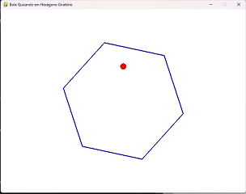

# bouncing-ball

## 📊 Descrição do Projeto

Este repositório contém implementações de um programa em Python que exibe uma bola quicando dentro de um hexágono giratório. A bola é afetada pela gravidade e pelo atrito, e interage de forma realista com as paredes rotativas do hexágono. O objetivo deste projeto é analisar e comparar os resultados gerados por duas inteligências artificiais distintas: DeepSeek R1 e ChatGPT 03-mini-high.

## 💡 Prompt Original

> Escreva um programa em Python que mostre uma bola quicando dentro de um hexágono giratório. A bola deve ser afetada pela gravidade e pelo atrito, e deve quicar nas paredes giratórias de forma realista.

## 🤖 Implementações

- **DeepSeek R1**: Uma inteligência artificial de código aberto desenvolvida pela startup chinesa DeepSeek. O modelo R1 é reconhecido por sua eficiência e capacidade de raciocínio avançado, rivalizando com modelos como o o1 da OpenAI. ([github.com](https://github.com/deepseek-ai/DeepSeek-R1?utm_source=chatgpt.com))

- **ChatGPT 03-mini-high**: Um modelo de inteligência artificial desenvolvido pela OpenAI, conhecido por suas respostas rápidas e precisas, especialmente em tarefas de codificação e raciocínio. A versão 03-mini-high oferece respostas de alta qualidade, sendo particularmente útil para tarefas de programação. ([openai.com](https://openai.com/index/openai-o3-mini/?utm_source=chatgpt.com))

## 🎯 Objetivo

Este projeto foi inspirado por uma publicação no Threads e tem como objetivo analisar o resultado final do script gerado por cada uma dessas inteligências artificiais, comparando suas abordagens e eficiências na resolução do problema proposto.

## 🔍 Comparação Visual

Abaixo, você pode ver uma comparação entre as execuções das duas versões do código:

### 🧠 DeepSeek R1


### 💬 ChatGPT 03-mini-high


## 🚀 Como Executar

1. Clone este repositório:

   ```bash
   git clone https://github.com/Bobagi/bouncing-ball
   ```

2. Navegue até o diretório do projeto:

   ```bash
   cd bouncing-ball
   ```

3. Instale as dependências necessárias (se houver):

   ```bash
   pip install -r requirements.txt
   ```

4. Execute o script desejado:

   ```bash
   python src/deepseek-R1/main.py
   ```

   ou

   ```bash
   python src/gpt-03-mini-high/main.py
   ```

## 🤝 Contribuição

Contribuições são bem-vindas! Sinta-se à vontade para abrir issues ou enviar pull requests com melhorias, correções ou novas implementações.

## 📄 Licença

Este projeto está licenciado sob a Licença MIT. Consulte o arquivo LICENSE para mais detalhes. 

PROMPT:
escreva um programa em Python que mostre uma bola quicando dentro de um hexágono giratório. A bola deve ser afetada pela gravidade e pelo atrito, e deve quicar nas paredes giratórias de forma realista